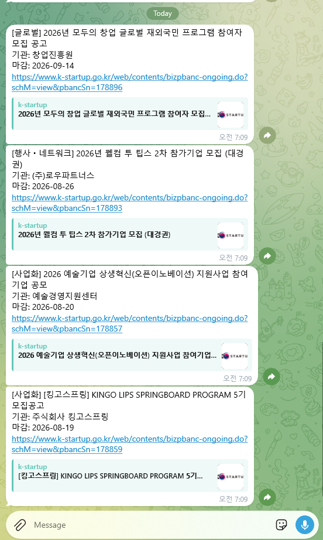
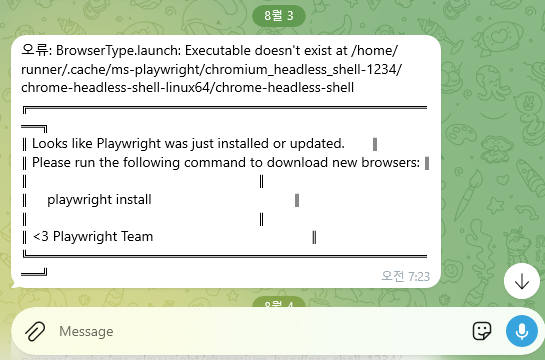

# gov-grant-notifier

IRIS와 K-StartUp에서 전날 공고된 정부 지원사업을 스크래핑해 텔레그램으로 매일 아침 알림을 보내는 자동화 도구입니다.

## 동작 방식

GitHub Actions 스케줄러(`UTC 21:30`, 지연 감안 시 실제 실행 **KST 09:30** 목표)가 매일 워크플로우를 실행합니다.

1. [IRIS](https://www.iris.go.kr) 공고 목록을 Playwright로 순회하며 **전날** 공고일자 항목 수집
2. [K-StartUp](https://www.k-startup.go.kr) 공고 목록을 Playwright로 순회하며 **전날** 등록일자 항목 수집
3. 수집된 공고를 텔레그램 봇으로 전송

## 동작 화면
### 공고 수신 화면


### 에러 수신 화면



## 프로젝트 구조

```
src/
  main.py         # 스크래핑 오케스트레이션 및 진입점
  scraper.py      # IRIS / K-StartUp HTML 파서
  telegram_bot.py # 텔레그램 메시지 포맷 및 전송
tests/
  test_scraper_iris.py
  test_scraper_kstartup.py
  test_telegram_bot.py
  test_main.py
  fixtures/       # HTML 스냅샷 (오프라인 테스트용)
.github/workflows/
  daily_notify.yml
```

## 로컬 실행

```bash
pip install -r requirements.txt
playwright install chromium --with-deps
```

`.env` 파일 또는 환경 변수로 아래 값을 설정합니다.

```
TELEGRAM_BOT_TOKEN=<봇 토큰>
TELEGRAM_CHAT_ID=<채팅 ID>
```

```bash
python -m src.main
```

## 테스트

```bash
pytest
```

`tests/fixtures/`의 HTML 스냅샷을 기반으로 동작하므로 네트워크 없이 실행됩니다.

## GitHub Actions 설정

레포지토리 **Settings → Secrets and variables → Actions**에 아래 두 시크릿을 등록해야 합니다.

| Secret 이름 | 설명 |
|---|---|
| `TELEGRAM_BOT_TOKEN` | 텔레그램 BotFather에서 발급받은 봇 토큰 |
| `TELEGRAM_CHAT_ID` | 알림을 받을 채팅(또는 채널)의 ID |
